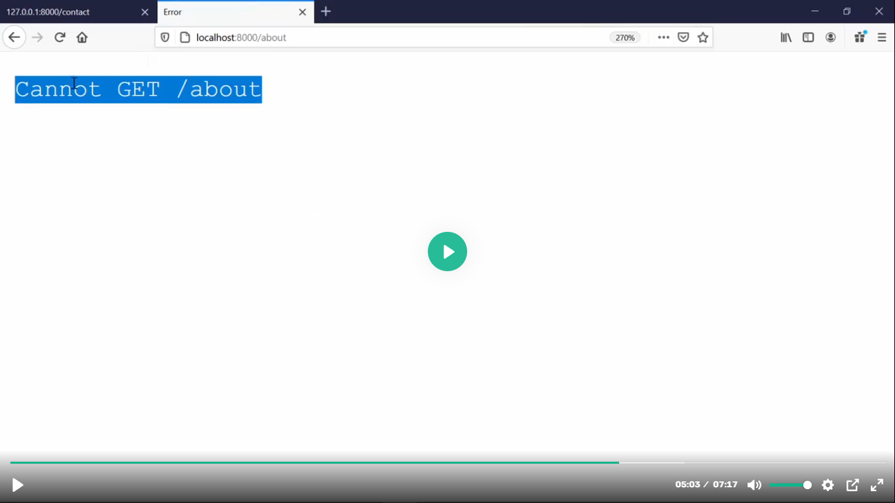
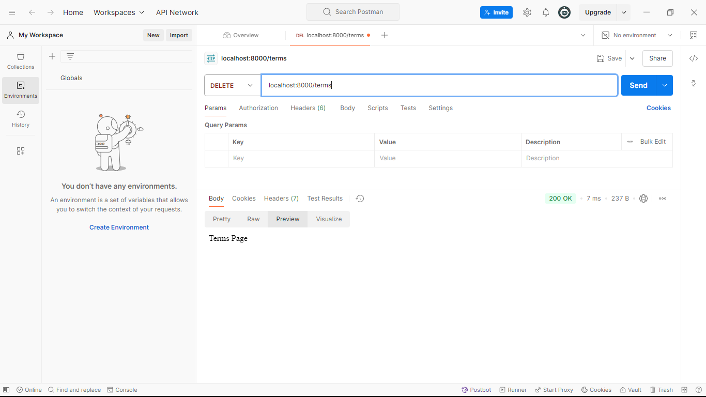

## Express Js Routing

- ### keyal korun goto video tutorial er code ta te:
``` javascript
//index.js
const express = require('express');
 

const app = express();

app.get('/',function(req,res){//1. Jokon amra ai get method ta make kori tokon er url er moddhe path hishebe amra '/' diyecilam. Atar mane home bujai. Akhon aikhane url er path kintu r o onk hote pare. Ai j alada alada url path dewar bishoita sheta kei bola hoi "Routing".
    res.send('Hello Express Js Hello')
})

app.listen(8000,()=>{
    console.log('Server is running successfully');
})

```
### Tahole cholun koyekta route make kore dekha jak:
```javascript
//index.js
const express = require('express');
 

const app = express();

app.get('/',function(req,res){
    res.send('Home Page');
})
app.get('/about',function(req,res){
    res.send('About Page');
})
app.get('/contact',function(req,res){
    res.send('Contact Page');
})
app.get('/terms',function(req,res){
    res.send('Terms Page');
})

app.listen(8000,()=>{
    console.log('Server is running successfully');
})
```
- ### tahole amra erokom`'/','/about','/contact','/terms'`  alada alada url extension diye alada alada route make korte pari. 
- ### `http://localhost:8000/terms` ai url ta valovabe keyal korun. ai url er j `/terms` namer extension ta k bole dicci sheta k bola hoi hocce "URI". "URO" stands for "Universal Resource Identifier". Orthad specific akta URI, specific akta resource k indicate korce. Jemon: `/terms`- terms page k indicate korce,'/about'- about page k indicate korce etc...
- ### Toh uporer index.js file ta keyal korun, prothekta route er khetre ami `GET` method use korechi. Ai karone prottekta routing end point ami browser diye access korte parbo. R browser er j default functionality, shei functionality shudu matro get request e korte parbe. Get request chara onno kono request k kintu browser shorashori url er maddhome access korte pare na.
- ### Toh get request chara onnanno req gula tikmoto kaj korce kina sheta test korer jonno amra postman use korte pari. Cause postman a shobdhoroner request methoderi functionality ache. Toh baki j req method ache sheta postman a test korer jonno ami index.js file k modify kore nicci:
```javascript

//index.js

const express = require('express');
 

const app = express();

app.get('/',function(req,res){
    res.send('Home Page');
})
//1. Postman a sob method k test korer jonno ami about ta k diye dicci post method.
app.post('/about',function(req,res){
    res.send('About Page');
})
//2.tarpor Contact ta k diye dilam put method.
app.put('/contact',function(req,res){
    res.send('Contact Page');
})
//3. tarpore terms ta k diye dilam delete method.
app.delete('/terms',function(req,res){
    res.send('Terms Page');
})

app.listen(8000,()=>{
    console.log('Server is running successfully');
})
```
- ### ami `about` k browser diye access korte pari kina sheta test korer jonno:

- ### As you can see amra post request ta k browser diye access korte parci na that means onno req method gula o browser diye access korete parbo na. Ei jonnoi amra postman use kori jathe onno request method gula diye code likhle shegula tik moto kaj korce kina shegula test kore dekte pari.

- ### As you can see amra postman tekhe amader create kora route gula access korte parci,routegula k define kora request method gula diye.