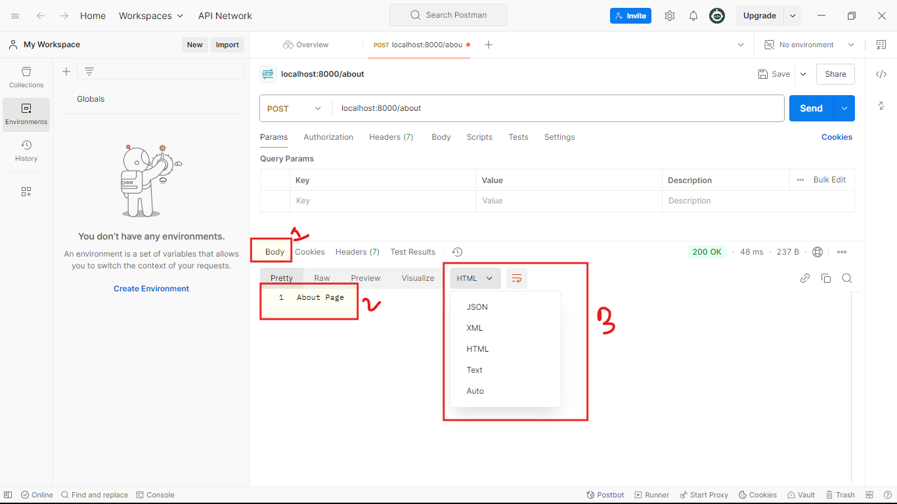

## Ei tutorial teke amra alochona suru korci Response niye.
- ### Toh prothomei amader jene nite hobe Response er ki ki ongsho thakhe, kon ongshe ki dhoroner data thake, kon ongsho ki ki kajhe bebohar hoi.

### Akta Response er mainly 4ta ongsho thake.
1. ### Response Body
2. ### Response Header
3. ### Response Status
4. ### Response Cookies
### Response er ei 4 ta ongsho kothai thakhe,kivabe thakhe, ki ki data ashe-naashe, aigula shomporkhe valovabe bujar jonno postman a chole jete hobe. Tar aghe ami, 3 number tutorial a j code ta likhechi shetai aikhane run koriye then postman open korci:
```javascript

const express = require('express');
const app = express();

app.get('/',function(req,res){
    res.send('Home Page');
})

app.post('/about',function(req,res){
    res.send('About Page');
})

app.put('/contact',function(req,res){
    res.send('Contact Page');
})

app.delete('/terms',function(req,res){
    res.send('Terms Page');
})

app.listen(8000,()=>{
    console.log('Server is running successfully');
})
```  
### Toh dorun ami posman a akti amader code onujayi `/about` a akti `post` request korlam:

- ### keyal kore dekun amra amader requester against a akta response peyechi. And amra already jani 1ta responser 4ta ongsho thakhe. Prothomei asha jak response bodyte(uporer chobite 1 mark kora ongsho k indicate korci). Response body te amra pacci 'About Page' content ta(uporer chobite 2 mark kora ongsho k indicate korci). Ai response body te json, xml, html, text typer jkono data aste pare(uporer chobite 3 mark kora ongsho k indicate korci).
### Er por ashun Response er Header a:

- ### Dekhtei paccen amra akhon response header a achi(uporer chobite 1 mark kora ongsho k indicate korci).
- ### Keyal korun Ai Response header a by default 7ta data ache(uporer chobite 2 mark kora ongsho k indicate korci).Amra caile kintu ai by default data gula chara response header a notun data add kore dite pari.  
### Er por ashun response er 3rd ongsho Response status a:

- ### Chobite Mark koro ongshotie response status k dekacce. jemonta dekte paccen Response status akta number k indicate kore. Jar akta nijossho meaning ache. Jemon akhane 200 ashce. Jar ortho holo shob tik ache. Erokom r o response status hote pare:
    - ### 500 -> Internal server error.
    - ### 404 -> Not Found
    - ### 401 -> Unauthorize
    - ### U can search google for more.
### Er por ashun 4th ongsho Response Cookies a:

- ### Mark kora area ta keyal korun Cookies namer akta tab ache. Toh amra jokon response create kori sha responser sathe amra cookie o create korte pari. Shei cookie te amra data o rekhe dite pari. 
### porer video tekhe amra chobite indicate kora topic gula step by step shikte takbo:

