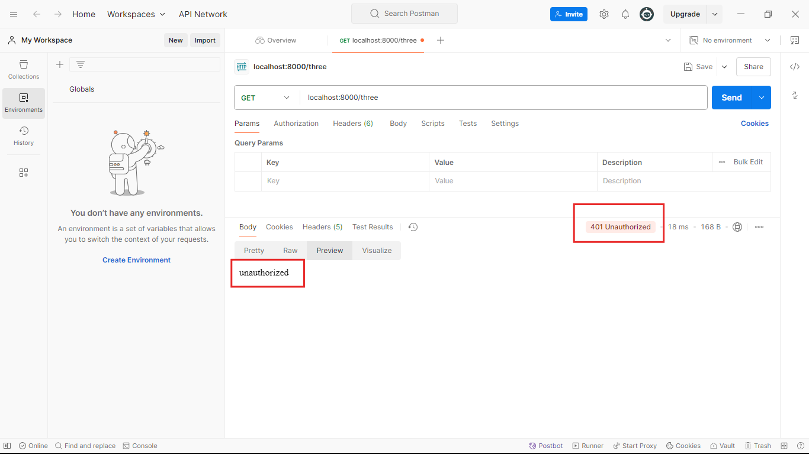

## Ei tutorial a amra response status k manipulate kora shikbo.
- ### Response status k manipulate korer jonno ami agher tutorial er code takei use korbo:
```javascript
//index.js
const express = require('express');
const app = express();

app.get('/one',function(req,res){
    res.end('This is simple string response');
})

app.post('/two',function(req,res){
    res.end('This is simple string response');
})

//1. Akhane ami r o akta route make kore nicci response status k manipulate korer jonno.
app.get('/three',function(req,res){
    //2.Toh status code k manipulate korer jonno res.status() k use korbo. And er parameter hishebe apni kon code ta dite chaccen sheta diye diben.
    //3. Erpor apnake Ei response k finish korte hobe. R finish korer jonno amader res.end() method use korte hobe. 401 mane jhetu unauthorized tai amra res.end() er parameter hishebe "unauthorized" k diye dite pari.
    res.status(401).end('unauthorized');  
})

app.listen(8000,()=>{
    console.log('Server is running successfully');
})
```
### Akhon ai code k run korale amra pabo:

### So apni chaile aivabe apni apnr response er status code change korte paren, kidoroner response patacchen shei context er upor base kore.
