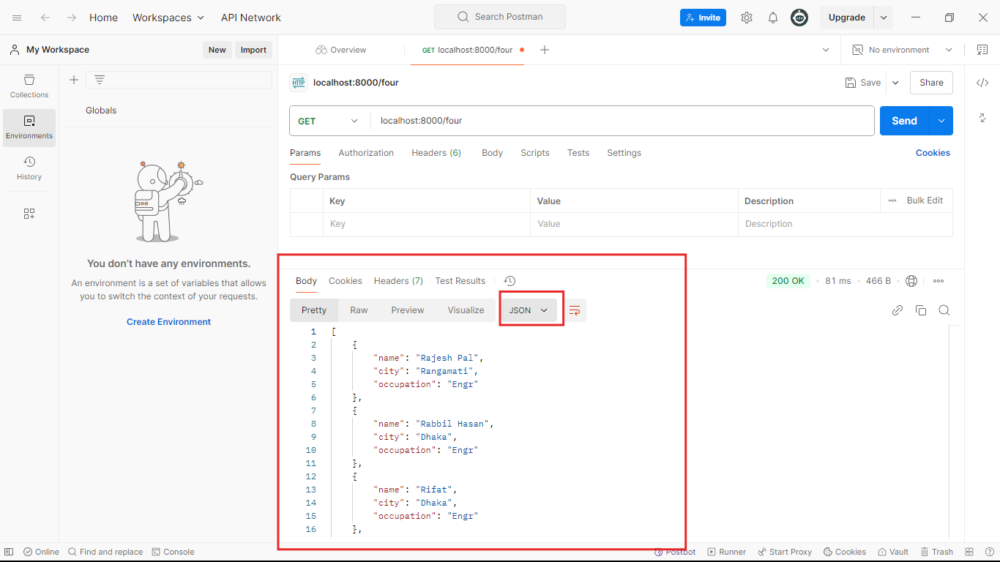

## Ei tutorial a amra JSON response niye kaj korbo.
- ### JSON Respone korer jonno ami agher tutorial er code takei use korbo:
```javascript
//index.js 
const express = require('express');
const app = express();

app.get('/one',function(req,res){
    res.end('This is simple string response');
})

app.post('/two',function(req,res){
    res.end('This is simple string response');
})


app.get('/three',function(req,res){
    res.status(401).end('unauthorized');  
})

//1. Akhane ami r o akta route make kore nicci JSON Response niye kaj korer jonno:
app.get('/four',function(req,res){
    //2. Toh JSON Reponse kore jonno amader res.json() method k use korte hobe. Ei method er vitore apni kon JSON array ta k response akhare patate chaccen sheta diye dite hobe.
    //3. Suppose ami aikhane simple akta  JSON array make kore nibo response  hisebe dewar jonno:
    let MyJSONArray=[
        {
            name: "Rajesh Pal",
            city: "Rangamati",
            occupation: "Engr",
        },
        {
            name: "Rabbil Hasan",
            city: "Dhaka",
            occupation: "Engr",
        },
        {
            name: "Rifat",
            city: "Dhaka",
            occupation: "Engr",
        },
        {
            name: "Rakib",
            city: "Rangpur",
            occupation: "Student",
        }
    ]

    res.json(MyJSONArray); 
})

app.listen(8000,()=>{
    console.log('Server is running successfully');
})
```
### Code ta k run korale amra amder response peye jabo:

- ### Amra dekte pacci response ta json akhare ashce and response type a jodi keyal koren tahole dekben ota o kintu by default JSON hoye gece.