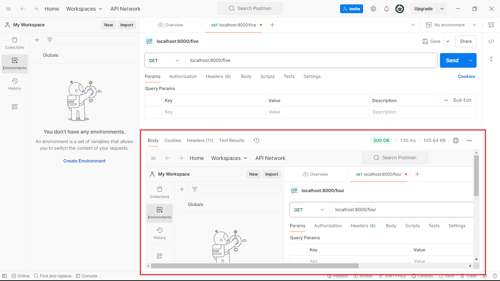

## Ei tutorial a amra Download response niye kaj korbo.
- ### Download Respone korer jonno ami agher tutorial er code takei use korbo:
```javascript
//index.js 
const express = require('express');
const app = express();

app.get('/one',function(req,res){
    res.end('This is simple string response');
})

app.post('/two',function(req,res){
    res.end('This is simple string response');
})


app.get('/three',function(req,res){
    res.status(401).end('unauthorized');  
})

app.get('/four',function(req,res){
   
    let MyJSONArray=[
        {
            name: "Rajesh Pal",
            city: "Rangamati",
            occupation: "Engr",
        },
        {
            name: "Rabbil Hasan",
            city: "Dhaka",
            occupation: "Engr",
        },
        {
            name: "Rifat",
            city: "Dhaka",
            occupation: "Engr",
        },
        {
            name: "Rakib",
            city: "Rangpur",
            occupation: "Student",
        }
    ]

    res.json(MyJSONArray); 
})

//1. Download response korer jonno ami akhane notun akta route create kore nicci.
app.get('/five', function(req,res){
    //2. Toh file k download koranor jonno amader project directory er root a "uploads" namer akta folder create korechi. And er bithore '1.png' namer akta image rekhe diyechi.
    //3. Download response korer jonno res.download() method use korte hobe. Apni kon file k download korate cacchen shei file er j path, sheta res.download() method er parameter hishebe diye dite hobe.
    res.download("./uploads/1.png");  
})


app.listen(8000,()=>{
    console.log('Server is running successfully');
})
```
### Code ta k run korale amra amder response peye jabo:

### Request ta browser diye korechi tai download er pop up ta peyechi. But apni jodi browser diye request na patiy postman diye patan tahole erokom pop up ta paben na cause postman a to browser er feature gula nai. Postman direct file ta k download kore puro preview tai shorashori amader dekiye dibe:

