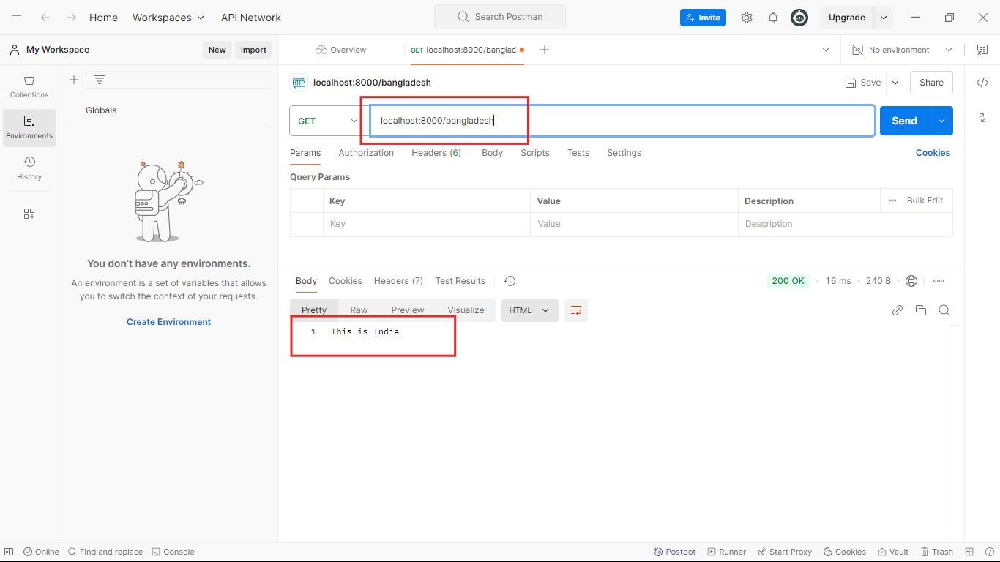

## Ei tutorial a amra Response Redirect niye kaj korbo.
- ### Respone Redirect korer jonno ami agher tutorial er code takei use korbo:
```javascript
//index.js 
const express = require('express');
const app = express();

app.get('/one',function(req,res){
    res.end('This is simple string response');
})

app.post('/two',function(req,res){
    res.end('This is simple string response');
})


app.get('/three',function(req,res){
    res.status(401).end('unauthorized');  
})

app.get('/four',function(req,res){
   
    let MyJSONArray=[
        {
            name: "Rajesh Pal",
            city: "Rangamati",
            occupation: "Engr",
        },
        {
            name: "Rabbil Hasan",
            city: "Dhaka",
            occupation: "Engr",
        },
        {
            name: "Rifat",
            city: "Dhaka",
            occupation: "Engr",
        },
        {
            name: "Rakib",
            city: "Rangpur",
            occupation: "Student",
        }
    ]

    res.json(MyJSONArray); 
})


app.get('/five', function(req,res){
    res.download("./uploads/1.png");  
})

//1. Response Redirect niye kaj korer jonno akhane notun 2ta route ami create kore nicci. 1tir nam dorlam /bangladesh and r ektar nam dorlam /india
app.get('/bangladesh', function(req,res){
    //2. Akhane ami jta korte cacci: jokon '/bangladesh' a kew request patabe tokon ai request ta redirect hoye '/indiar' kache chole jabe. Er jonno amader res.redirect() method use korte hobe and er parameter hishebe amra jkhane redirect korte chacci shei url ta diye dibo:
    res.redirect("http://localhost:8000/india");
})

app.get('/india', function(req,res){
    res.send("This is India");
})


app.listen(8000,()=>{
    console.log('Server is running successfully');
})
```
### Code ta k run korale amra amder response peye jabo:

### As you can see in the picture amra request patiyechi `/bangalades` route a but response pacci `/india` route er.

