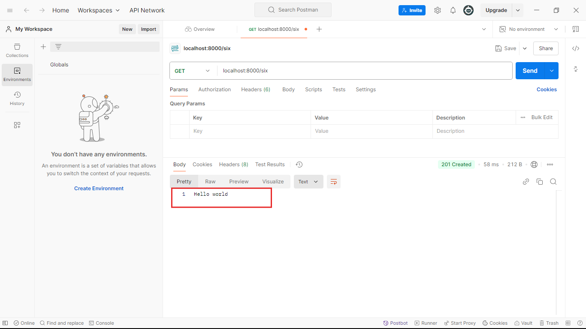

## Ei tutorial a amra Response Header niye kaj korbo.
- ### Apni Response haeader a o value rakhte pare tobhe she key-value pair a.
- ### Respone Header korer jonno ami agher tutorial er code takei use korbo:
```javascript
//index.js 
const express = require('express');
const app = express();

app.get('/one',function(req,res){
    res.end('This is simple string response');
})

app.post('/two',function(req,res){
    res.end('This is simple string response');
})


app.get('/three',function(req,res){
    res.status(401).end('unauthorized');  
})

app.get('/four',function(req,res){
   
    let MyJSONArray=[
        {
            name: "Rajesh Pal",
            city: "Rangamati",
            occupation: "Engr",
        },
        {
            name: "Rabbil Hasan",
            city: "Dhaka",
            occupation: "Engr",
        },
        {
            name: "Rifat",
            city: "Dhaka",
            occupation: "Engr",
        },
        {
            name: "Rakib",
            city: "Rangpur",
            occupation: "Student",
        }
    ]

    res.json(MyJSONArray); 
})


app.get('/five', function(req,res){
    res.download("./uploads/1.png");  
})


app.get('/bangladesh', function(req,res){
    res.redirect("http://localhost:8000/india");
})

app.get('/india', function(req,res){
    res.send("This is India");
})

//1. Response Header niye kaj korer jonno akhane notun 1ta route ami create kore nicci.
app.get('/six', function(req,res){
    //2. Response header a value add korer jonno amader res.append() use korte hobe. And amra j key-value pair ta response header a add korte chacci sheta diye dibo er vithore. 
    res.append("name","Rajesh Pal");
    //3. Erokom apni onk gula key-value pair append kore dite paren:
    res.append("city","Dhaka");
    res.append("age","30 Years Old");

    res.status(201).end("Hello world");
})

app.listen(8000,()=>{
    console.log('Server is running successfully');
})
```
### Code ta k run korale amra amder response peye jabo:


### As you can see amra amader desired response peye gelam.

