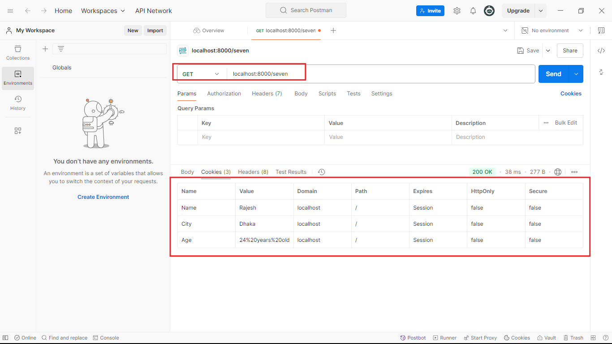
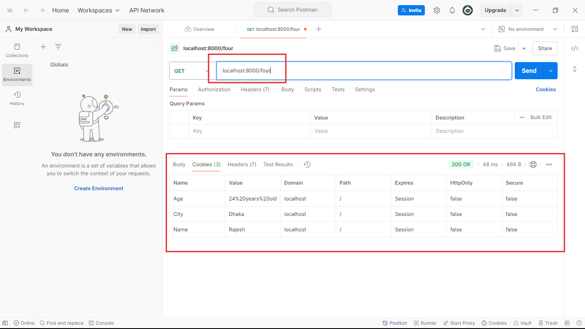
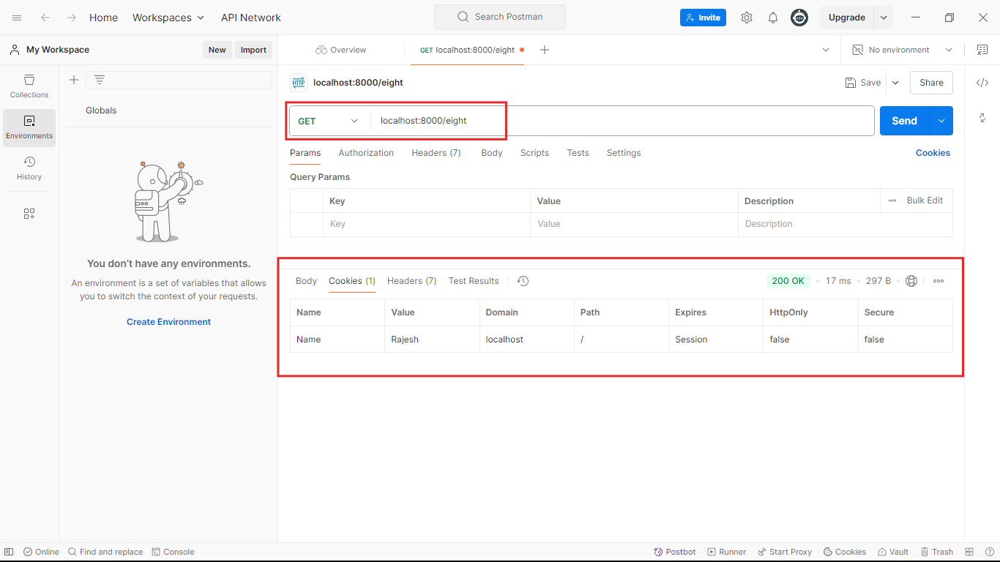

## Ei tutorial a amra Cookie tekhe data clear kora shikbo.
- ### Cause cookie te jokon data set hoye jai tokhon sheta clear na kora porjontho tekhe jabe.
- ### Respone a Cookies set korer jonno ami agher tutorial er code takei use korbo:
```javascript
//index.js 
const express = require('express');
const app = express();

app.get('/one',function(req,res){
    res.end('This is simple string response');
})

app.post('/two',function(req,res){
    res.end('This is simple string response');
})


app.get('/three',function(req,res){
    res.status(401).end('unauthorized');  
})

app.get('/four',function(req,res){
   
    let MyJSONArray=[
        {
            name: "Rajesh Pal",
            city: "Rangamati",
            occupation: "Engr",
        },
        {
            name: "Rabbil Hasan",
            city: "Dhaka",
            occupation: "Engr",
        },
        {
            name: "Rifat",
            city: "Dhaka",
            occupation: "Engr",
        },
        {
            name: "Rakib",
            city: "Rangpur",
            occupation: "Student",
        }
    ]

    res.json(MyJSONArray); 
})


app.get('/five', function(req,res){
    res.download("./uploads/1.png");  
})


app.get('/bangladesh', function(req,res){
    res.redirect("http://localhost:8000/india");
})

app.get('/india', function(req,res){
    res.send("This is India");
})

app.get('/six', function(req,res){ 
    res.append("name","Rajesh Pal");
    res.append("city","Dhaka");
    res.append("age","30 Years Old");
    res.status(201).end("Hello world");
})

app.get('/seven', function(req,res){ 
    res.cookie("Name","Rajesh");
    res.cookie("City","Dhaka");
    res.cookie("Age","24 years old");
    res.end("Successfully set cookies");
})
//1. Cookie teke data clear korer jonno akhane notun 1ta route ami create kore nicci.
app.get('/eight', function(req,res){ 
    //2. cookie thekhe data deleter korer jonno res.clearCookie() method k call korte hobe. Method tar moddhe apni property ta k clear korte chan sheta diye dite hobe.
    //3. dorun ami aikhan tekhe city and age k delete kore dibo:
    res.clearCookie('City');
    res.clearCookie('Age');
    res.end("Cookie clear success");
})

app.listen(8000,()=>{
    console.log('Server is running successfully');
})
```
### Nicher screenshot gula valo kore keyal korun:

- ### dekhtei paccen code ta k run korer por amra jokon `/seven` route a request patalam amader cookie set hoye gelo.

- ### erpor dekhun, amra `/four`route a request korer por o kintu amader cookie gula tekhe jacce. Ai jonnoi amader cookie clear korte hoi na hoi tekhe jabe aigula.

- ### Dekhun, Jokon amra `/eight` route a request patalam tokon 'city' and 'age' cookie delete hoye gece as expected.
