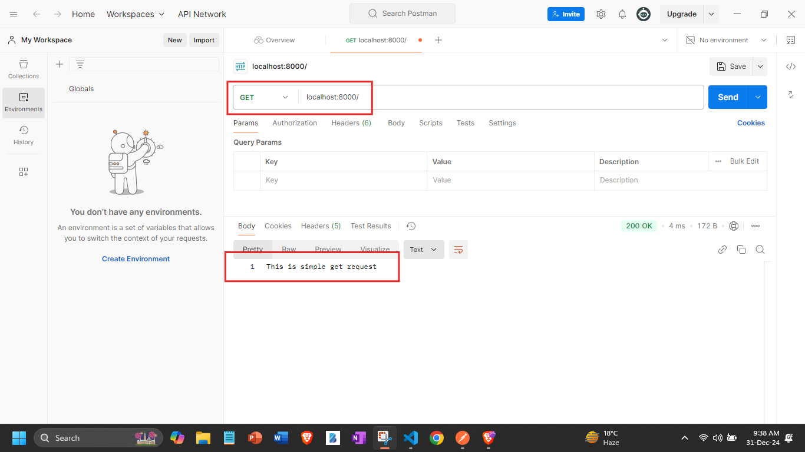

## Ei tutorial a amra Simple Get request kora shikhbo:
```javascript
//index.js 
const express = require('express');
const app = express();
//1. request make korte hole, amra j express() er instannce create korlam 'app',ei 'app' instance/object thekei amra request er method k call korbo. Akhon apner request 'get' hole 'get' method k call korben,'post' hole 'post' method k call korben and so on.. Amra aikhane jehetu simple get request kora shikci tai simply get k call korbo:
app.get('/',function(req,res){
    
    // 4. So as you can see amra akta simple get request create kore fellam.
    // 5. Akhon ai request er against a oboshoi amader akta response dite hobe.Toh aikhane ami kuv simple akta response diye dicci:
    res.end("This is simple get request");
}//3. Ai callback function a amra 2ta parameter peye jacci, 1ta hocce 'request' onnota 'response'.

);//2. ai get request 2ta arguments nei, 1ta hocce request url and r ekta hocce callback function. 
app.listen(8000,()=>{
    console.log('Server is running successfully');
})
```
### Akhon jodi run korai and `localhost:8000/` url tate get request patai:

- ### Tahole dekhtei paccen amra amader request er against a response peye gelam as expected. 

