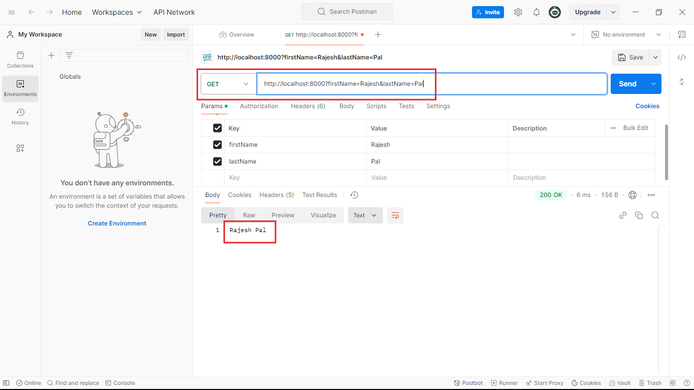

## Ei tutorial a amra Request er URL query niye kaj korbo:
- ### Akta URL er query parameter ki? sheta akta example er help niye buja jak:
    - ### Ai URL k consider korun: `http://localhost:8000?firstName=Rajesh&lastName=Pal`
    - ### Ai url er moddhe `?` er por 'firstName' and 'lastName' k query parameter bole. And ai ulr er quary parameter gular value hocce 'Rajesh' and 'Pal' respectively.

```javascript
//index.js 
const express = require('express');
const app = express();

app.get('/',function(req,res){
    
    //1.Request query niye kaj korer jonno 'req.query.parameterName' ei format a apnake query parameter k access korte hobe like below:
    let firstName=req.query.firstName;  
    let lastName=req.query.lastName;  
    res.end(firstName +" "+lastName);
}); 
app.listen(8000,()=>{
    console.log('Server is running successfully');
})
```
### Akhon jodi code ta k run korai and `http://localhost:8000?firstName=Rajesh&lastName=Pal` url a get request patai:

- ### Tahole dekhtei paccen amra amader request er against a response peye gelam as expected. 

