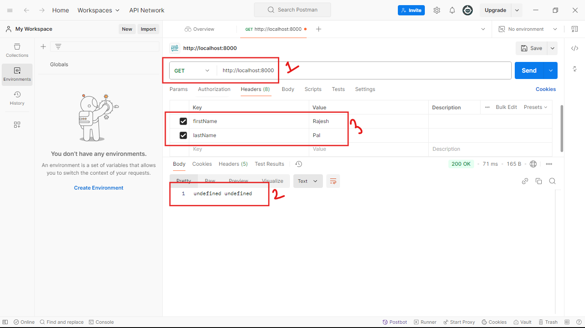
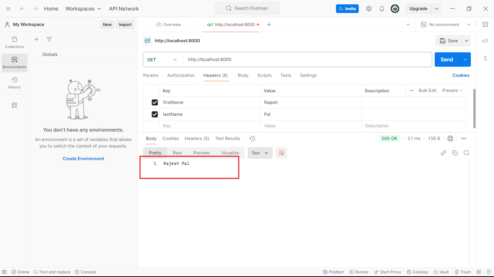

## Ei tutorial a amra get Requester header niye kaj kora shikbo:


```javascript
//index.js 
const express = require('express');
const app = express();

app.get('/',function(req,res){
    
    //1.Request er Header niye kaj korer jonno amra 'req' parameter tekhe req.header() k use korte hobe. And er parameter hishebe kon property k amra access korte cacci sheta bole dibo:
    let firstName= req.header('firstName');//2. Tahole firstName namer kono header property diye jodi amra request patai tahole shei property er value amra aikhane peye jabo. 
    //3. Akhivabe amra baki header property gula k access korte parbo:
    let lastName = req.header('lastName');
    res.end(firstName + ' '+lastName);
}); 
app.listen(8000,()=>{
    console.log('Server is running successfully');
})
```
### Akhon jodi code takhe run korai and postman a jai:


- ### tahole dekhtei paccen(Uporer chobir 1no. box)  jokon`http://localhost:8000` url a header property set na kore get request patai tokon `undefined undefined` pacci(Uporer chobir 2no. box). And jokon header property set korlam (Uporer chobir 3no. box) and request patalam:

- ### Tahole dekhtei paccen amra amader desired response peye gelam as expected. 
- ### Ekhivabe apni request header er j default property gula ache shegula k o access korte parben.

