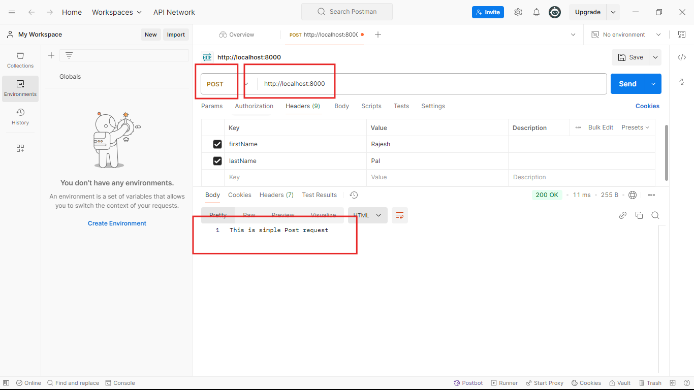

## Ei tutorial a amra simple Post Requester create kora shikbo:


```javascript
//index.js 
const express = require('express');
const app = express();

//1. Post request korer jonno 'express()' er j instance/object 'app' amra creater korecilam shekan tekhe app.post() k use korte hobe.
app.post('/',(req,res)=>{
    //4. Tahole dekhun amader simple post request create hoye gece.Akhon ai request er against a ami akta simple response diye dicci:
    res.send("This is simple Post request")

}//3. ai callback function er o 2ta parameter ache: Request and Response.

);//2. Then get request er mothoi aikhane o 2ta arguments dite hobe: Request URL and Callback function. 
app.listen(8000,()=>{
    console.log('Server is running successfully');
})
```
### Akhon jodi code takhe run korai and postman a jai:


- ### tahole dekhtei paccen amra amader simple post request er response peye gelam as expected.

