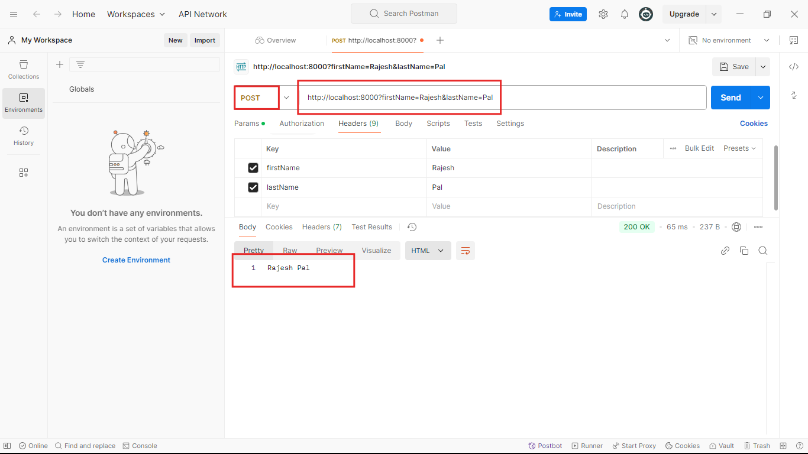

## Ei tutorial a amra Post Requester er query parameter niye kaj kora shikbo:


```javascript
//index.js 
const express = require('express');
const app = express();

app.post('/',(req,res)=>{
  //1. Get requester er mothoi aikhane o 'req.query.parameterName' ai format a query parameter k access kore kaj korte hobe like below:
  let firstName=req.query.firstName;
  let lastName =req.query.lastName;
  res.send(firstName +' '+lastName);
}

); 
app.listen(8000,()=>{
    console.log('Server is running successfully');
})
```
### Akhon jodi code takhe run korai and postman a jai and `http://localhost:8000?firstName=Rajesh&lastName=Pal` url a request patai:


- ### tahole dekhtei paccen amra amader desired response peye gelam as expected.

