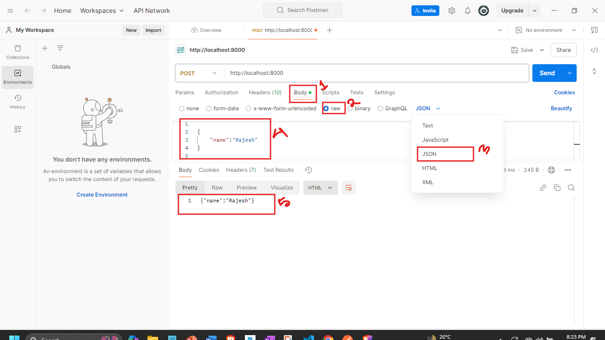

## Ei tutorial a amra Post Requester er bithore json body k manage kora shikbo:


```javascript
//index.js 
const express = require('express');
//1.JSON body k manage korer jonno amader application er bithore 'body-parser' er j node package ache sheti first a install kore nite hobe.
// 1.1 install korer jonno terminal a 'npm install body-parser'command k run korate hobe.
// 1.2 Er por packageti k import Kore nithe hobe:
const bodyParser = require('body-parser'); 
const app = express();

//2. Then amader k 'body-parser' tekhe JSON k use korte hobe:
app.use(bodyParser.json());//3. 'body-parser' tekhe json() use korle, amra app.post() method er callback function er 'request' parameter tekhe 'body' property k access korle,body te jodi kono JSON post kora hoi tahole sheta access korte parbo. 

app.post('/',(req,res)=>{
  
  let JSONData = req.body;//4. amra jehetu request er body k access korci tai kew jodi ai route a JSON post kore tahole sheta JSONData variable a store hoye jabe.
  //5. Akhon ai JSONData k output a dekhar jonno stringify korte hobe. er jonno JSON.stringify() method use korte hobe like below:
  let JSONString = JSON.stringify(JSONData);
  res.send(JSONString);

}); 

app.listen(8000,()=>{
    console.log('Server is running successfully');
})
```
### Akhon code takhe run koriye ami postman tekhe Post request er body er sathe JSON patanor jonno :
- ### body tab a jabo(chobir 1no. box)
- ### raw select korbo(chobir 2no. box)
- ### dropdown tekhe JSON select korbo jehetu req body er sathe json patabo (chobir 3no. boc)
- ### er por json object ta likhte hobe(chobir 4no. boc) and send a click korbo:


- ### tahole dekhtei paccen amra amader desired response peye gelam(chobir 5no. box) as expected.

