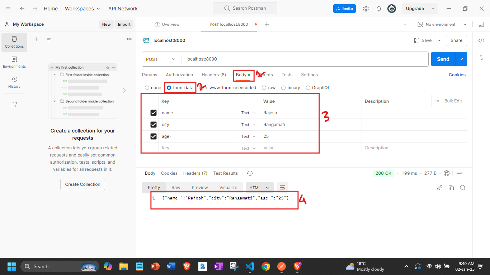

## Ei tutorial a amra Multipart form data k handle kora shikbo:
- ### Clientside tekhe severside a jokon kono form submit kora hoi,tokho beshirbag khetrei kintu form gula k multipart form data hishebei submit kora hoi.
- ### Toh multipart form data jodi amader serverside a ashe sheta k manage korer jonno `multer` namer akta package ache jta amader k use korte hobe.
- ### Multer k download korer jonno amader project a `npm install --save multer` command k terminal a run korate hobe.


```javascript
//index.js 
const express = require('express');
//1.Toh multer diye maltipart form data k manage korer jonno amader firstei amra import kore nibo.
const multer = require('multer');//1.1 Multer is a middleware for handling multipart/form-data.
const app = express();
//2.Then amra jrokom express er instance create korechi tik samevabe amader multer er o instance create kore nithe hobe:
const multerInstance = multer();

//3.Then amader j express() er instance 'app' ache shei 'app' er bithore multerInstance.array() k use korbo.
app.use(multerInstance.array());//3.1 This allows the server to parse form data into an array of objects.
//4. Erpor amader express er j static method royece shekhane 'public' k parameter hishebe pass koriye shei methodta k 'app' er moddhe use korte hobe: 
app.use(express.static('public'));
//4.1 "express.static('public') this makes the contents of the public folder accessible to clients (browsers) as static assets.
//4.2 The line "app.use(express.static('public'));" is used to serve static files from the public directory.

app.post('/',(req,res)=>{
  //5. So amra akhon simply request tekhe body property k read korle multipart form data peye jabo. And then ata k stringify kore dilei amra ata k jvabe icce shevabe use korte pari.
  let JSONData = req.body;
  let JSONString = JSON.stringify(JSONData);
  res.send(JSONString);
}); 

app.listen(8000,()=>{
    console.log('Server is running successfully');
})
```
### Akhon ami code ta k run koriye postman use korbo jate ami post request er sathe multipart form data patate pari. Postman use kore multipart form data post korer jonno postman open kore:
- ### body tab a jabo(chobir 1no. box)
- ### form-data select korbo(chobir 2no. box)
- ### key value pair a form data gula diye dibo and then send kore dibo. (chobir 3no. boc)


- ### tahole dekhtei paccen amra amader desired response peye gelam(chobir 4no. box) as expected.

