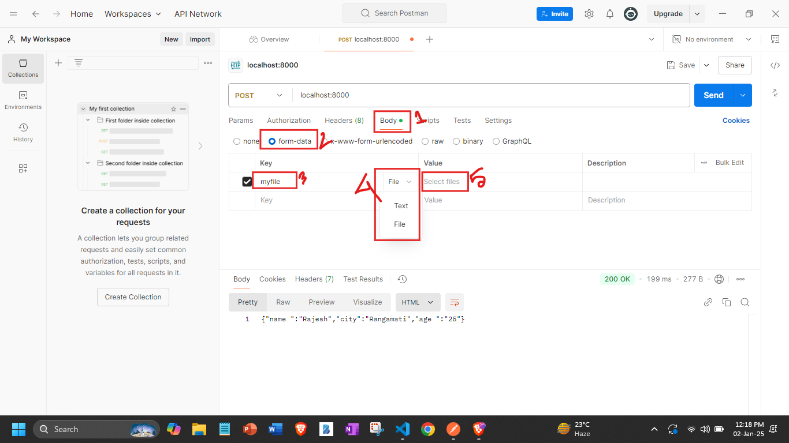
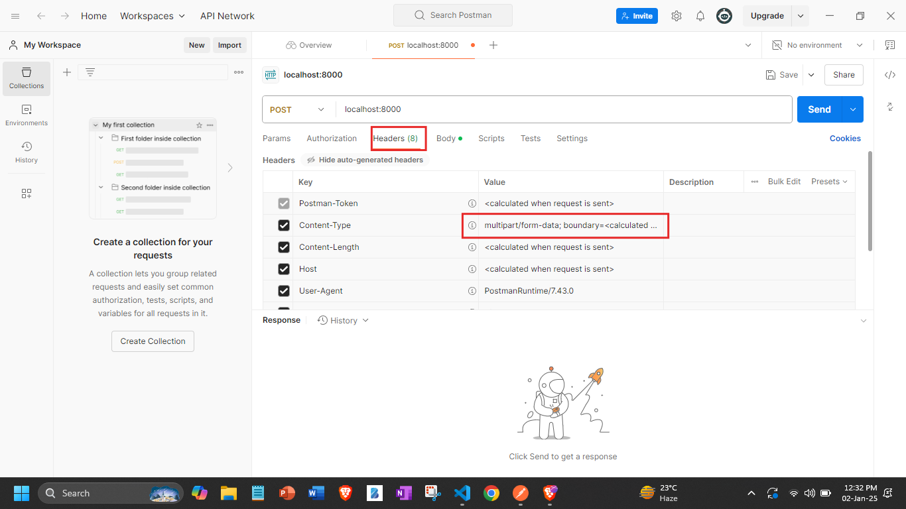
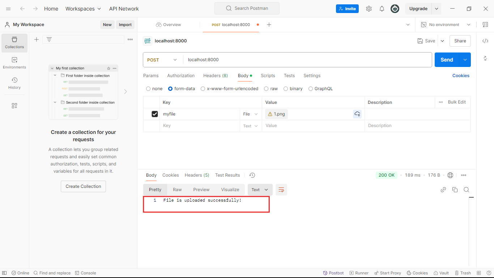

## Ei tutorial a amra Multer diye file upload kora shikbo:


```javascript
//index.js 
const express = require('express');
const multer = require('multer');
const app = express();
const multerInstance = multer();
//1.Toh multer diye file upload korer jonno multerInstance tekhe multerInstance.diskStorage() method k use korte hobe.
var storage = multer.diskStorage({
  //3. ai destination property er moddhe amader abr akti callback function define kore dite hobe jta 3ta parameter nibhe:request,file & callback function.
  destination:function(req,file,callback){
    //4.Then aikhan tekhei amader callback k call kore dite hobe, and ei callback er argument hishebe amader first parameter null and 2nd parameter a amra file ta k j path a upload korte cacci sheta diye dite hobe.
    callback(null,'./uploads')
  },
  //5. Ekivabe filename a o akti callback function define kore dite hobe jta o 3ta parameter nibhe:request,file & callback function.
  filename:function (req,file,callback){
    //6.Ekivabe amra aikhanteke o callback takhe call dibo like below:
    callback(null,file.originalname);
  }
});//2. Ei method argument hishebe akta object nibe.And ai object er moddhe amader 2ta property define kore dte hobe 'destination' & 'filename', jmn ta aikhane kore dewa ace.

//7. akhon multer.diskStorage() diye j amra storage create kore nilam shei storage k aikhane initiate kore nite hobe like below:
var upload = multer({storage:storage}).single('myfile');

app.post('/',(req,res)=>{
  //8. then jokon amra post request a kono file pabo tokon shei file ta multer diye j 'upload' make kore niyechi sheta k niche dekhano example er moto kore call korte hobe:
  upload(req,res,function(err){
    if(err){
      return res.end("Error uploading file.");
    }
    res.end("File is uploaded successfully!")
  });
  
}); 

app.listen(8000,()=>{
    console.log('Server is running successfully');
})
```
### Akhon ami code ta k run koriye postman use korbo jate ami post request er sathe akta file upload korer post request patate pari. Postman use kore file upload korer post request korer jonno, postman open kore:
- ### body tab a jabo(chobir 1no. box)
- ### form-data select korbo(chobir 2no. box)
- ### jehetu amra bolei diyechi code er moddhe 'myfile' namer key tei amra file ta upload korbo tai amra key set kore dilam 'myfile'. (chobir 3no. box)
- ### then amra dropdown tekhe file type file select kore dibo.(chobir 4no. box)
- ### then chobithe dekhano 5no. box  a j slect files er option ache sheta click kore file upload kore dibo.

- ### Erpor apni jodi header tab a giye dekhen, automatically shekhane content-type property er value `multipart/form-data` hoye gece cause apni body tab a form-data option ta k select korechen. R content-type file upload er jonno obosshoi `multipart/form-data` hote hobe:


- ### Er por apni jodi post request send koren tahole dekhun file upload hoye gece:

- ### One things to note here is that apni j folder ta te file upload korben shei folder ta k first a manually create kore rakhben oi folder create kora charai file upload er request patale error khaben.

---
***
___
## Ami j code ta likheci upore shtar explination chatgpt tekhe:

Your code sets up an Express server that allows users to upload a single file to a specific folder (`uploads`) on the server. Let me explain how it works step by step:

---

### **Code Breakdown**

1. **Importing Dependencies:**
   ```javascript
   const express = require('express');
   const multer = require('multer');
   ```
   - `express`: Framework to create the server.
   - `multer`: Middleware to handle `multipart/form-data` (used for file uploads).

---

2. **Setting Up Multer Storage:**
   ```javascript
   var storage = multer.diskStorage({
     destination: function (req, file, callback) {
       callback(null, './uploads');
     },
     filename: function (req, file, callback) {
       callback(null, file.originalname);
     }
   });
   ```
   - **`diskStorage`**: Configures where and how the files will be saved.
     - **`destination`**: Specifies the folder where files will be stored.  
       Here, files are saved in the `uploads` folder.
     - **`filename`**: Sets the name of the uploaded file.  
       The uploaded file will keep its original name (`file.originalname`).

---

3. **Creating Multer Instance:**
   ```javascript
   var upload = multer({ storage: storage }).single('myfile');
   ```
   - Configures Multer to use the `storage` options defined above.
   - `.single('myfile')`: Handles a single file upload with the field name `myfile`.

---

4. **Handling the POST Request:**
   ```javascript
   app.post('/', (req, res) => {
     upload(req, res, function (err) {
       if (err) {
         return res.end("Error uploading file.");
       }
       res.end("File is uploaded successfully!");
     });
   });
   ```
   - When a file is uploaded to `/`, the `upload` function processes it.
   - If there's an error during upload (e.g., invalid file type), it returns `"Error uploading file."`
   - On success, it sends `"File is uploaded successfully!"`.

---

5. **Starting the Server:**
   ```javascript
   app.listen(8000, () => {
     console.log('Server is running successfully');
   });
   ```
   - The server listens on port `8000`.

---

### **Folder Structure**
Make sure your project folder has an `uploads` directory where files can be stored:
```
project/
├── uploads/   <-- This is where files will be saved
├── index.js
```

---

### **How to Test**
1. Create an HTML form to test file uploads:
   ```html
   <form action="http://localhost:8000" method="POST" enctype="multipart/form-data">
     <label for="myfile">Choose file:</label>
     <input type="file" name="myfile" id="myfile" required>
     <button type="submit">Upload</button>
   </form>
   ```

2. Start the server:  
   Run the file using `node index.js`.

3. Open the form in your browser and upload a file.  
   - The file will be saved in the `uploads` folder.

---

### **Example Output**
#### After Uploading a File:
- File: `example.txt`
- Location: `uploads/example.txt`

#### Response:
```
File is uploaded successfully!
```

---

### **Error Handling**
You can enhance error handling like this:
```javascript
if (err instanceof multer.MulterError) {
  return res.status(500).send("Multer Error: " + err.message);
} else if (err) {
  return res.status(500).send("Unknown Error: " + err.message);
}
```


