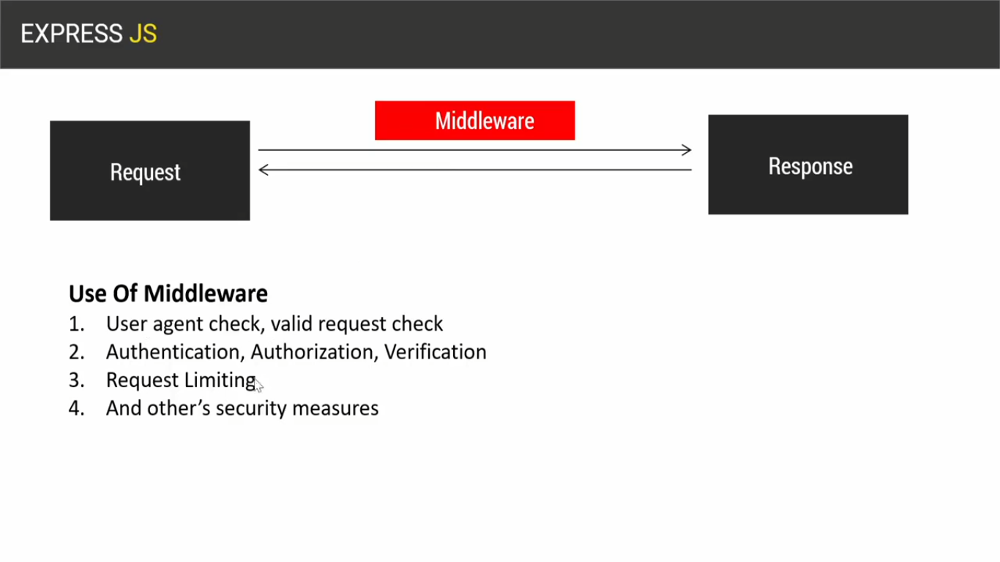

## Ei tutorail a amra middleware niye alochona korbo.
- ### jkono severside technology er jonno middleware kuvi gurutthopurno akta bishoi.
- ### Middleware k bug(separate/devide) korle amra pabo `Middle + Ware`.
- ### Middle er bangla ortho মধ্যম and Ware er ortho সতর্কতা
- ### Tar mane Middleware er full bangla meaning jodi amra dhar korai sheta hoi `মাঝখানের সতর্কতা / সচেতনতা`
- ### Akhon ai j `মাঝখানের সতর্কতা / সচেতনতা`ai bishoyta amader serverside er sathe jai kivabe?

- ### Serverside a thakhe request and response. Ei j 2ta bishoy request and response, ei 2 bishoyer majhe jodi kono bishoy shonghotito hoi tokhon shei bishoi takhei amra middlware boli.
- ### Orthad server a jokon kono request ashe and response jai, tokhon request and response er majhe j code gula exicute hoi shei code gula k amra boli middleware.
- ### Ekhon ei code hote pare single line of code,hote pare function, hote pare class, jkono types of code kintu middleware hote pare. Specefic vabe bola jabe na j middleware akta class ba bola jabe na j middleware akta function.
- ### Jokhon server a kono request ashbe, request ashar pore response er aghe middleware exicute hobe.
- ### Orthad middleware request and response er majkhane akta shotorkothamulok/ shochatonothamulok kaj kore. Ai j ami bollam shotorkothamulok/ shochatonothamulok kaj,ai shotorkothamulok/ shochatonothamulok kaj bolte bujacci:
  - ### Sadharonoto middleware amra User agent check kora,request er validity check korer jonno use kori
  - ### Tarpore Authorization, Authentication, Verification er jonno middleware er use hoi.
  - ### Bibinno shomoy server a DoS attack ashe, shei DoS attack k atkhai dewar jonno shekhane Request Limiting kore dithe hoi. Request limiting hocce Apner server a 1 min er moddhe 600 er beshi request ashte parbe na, jodi ei limit er baire request ashe tahole server kono response dibhe na. Toh ai j server a akta niddhrishto shomoye koto gula maximum request aste pare shei limit set kore deawar bishoita sheta k bola hoi request limiting jta amra middleware er maddhome kore thaki.
  - ### Aichara o request and responser majhe j other's security measures gula ache sehi security measures gula amra middleware er maddhome kore thaki.

## Akhon ei middleware er j obostan ta ba bebohar ta abr 2 dhoroner hote pare: Application level hote pare, Route level hote pare.
  1. ### Application level: 1ta middleware jodi shobgula req and res er jonno kaj kore tokhon sheta k amra bolbo application level middleware.
  2. ### Route level: Alada alada route er jonno alada alada middleware kaj kore tokhon sheta k amra bolbo Route level middleware.
